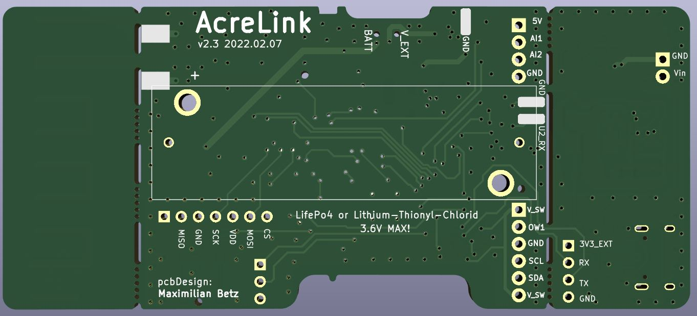

# AcreLink Node

- Designed for a sleep current around 6 to 7 uA. 
- ESP32
- RFM95 Lora Module
- 868MHz PCB antenna, can be cut off and replaced by an SMA connector
- AA size lithium battery driven: (LS14500 Lithium-Thionyl-Chlorid or LifePo4 possible)
- Boost converter to supply sensors with stable 5V. Can be switched off for low current sleep mode
- External connector for Onewire, analog inputs and I2C including ESD protection with very low current TVS diodes
- Sensing battery voltage. Can be disabled for low sleep current
- Red led for signaling activity
- Mechanical switch to select battery of external power supply 
- Separate removable pcb section with wide range power supply 5 - 25V,  USB-C connector and USB-UART adapter for programming

## 3D Preview 

## Pin Mapping ESP32
- AnalogInput1 : PIN13  GPIO14  ADC2_CH6
- Analog Bat   : PIN16  GPIO13  ADC2_CH4 
- AnalogInput2 : PIN11 GPIO26   ADC2_CH9
- I2C SDA	   : PIN33 GPIO21 		
- I2C SCL 	   : PIN36  GPIO22     
- UART2_RX     : PIN27 GPIO16        
- UART2_TX     : PIN28 GPIO17 		 
- 5V Buck EN   : PIN12 GPIO27 		
- LED_Signal   : PIN9 GPIO33
- RFM_MISO     : PIN31  GPIO19 
- RFM_MOSI     : PIN37  GPIO23 
- RFM_SCK      : PIN30  GPIO18
- RFM_CS       : PIN29  GPIO5
- RFM_RST      : PIN23  GPIO15 
- RFM_IRQ      : PIN26  GPIO4 

## Links
- Antenna Design: https://github.com/cernohorsky/LoRa-Node  
- Selected soil sensor: https://de.aliexpress.com/item/1005001411485735.html?gatewayAdapt=glo2deu&spm=a2g0o.9042311.0.0.27424c4dQoBMf8 Supplyvoltage 3.6V - 30V.    Two analog outputs  0 to 2 V  for  soil temperature and soil humidity. ~5mA current consumption at 4V 

### Oher Links for reference
https://www.metergroup.com/de/environment/produkte/teros-21/

https://www.metergroup.com/de/environment/produkte/teros-10/

https://www.metergroup.com/de/environment/

https://de.aliexpress.com/item/32750933038.html?spm=a2g0o.productlist.0.0.62fa2b2dD94RVC&algo_pvid=56dd73b6-6484-4bd3-be9a-3d29279feaf3&algo_expid=56dd73b6-6484-4bd3-be9a-3d29279feaf3-32&btsid=2100bddb16056484973607092e316c&ws_ab_test=searchweb0_0,searchweb201602_,searchweb201603_

https://de.aliexpress.com/store/915786

https://www.ugt-online.de/produkte/bodenkunde/bodenfeuchtetemperaturleitfaehigkeit/sm150t/

https://www.delta-t.co.uk/product/sm150t/

https://de.aliexpress.com/item/32793236869.html?spm=a2g0s.8937460.0.0.3a672e0eRfM3vv

- Usefull for pin mapping: https://www.electroniclinic.com/esp32-wroom-32d-pinout-features-and-specifications/ 